# FreshCart - React eCommerce Template

<p align="center">
  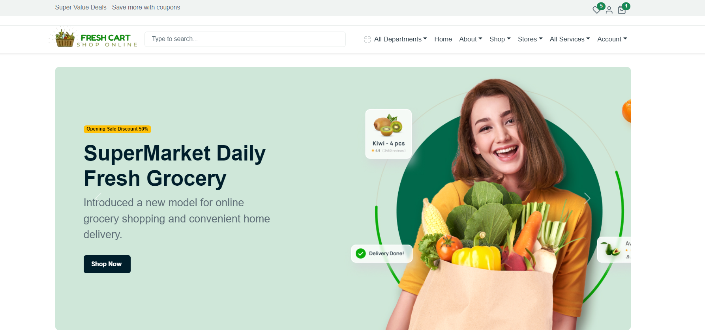
  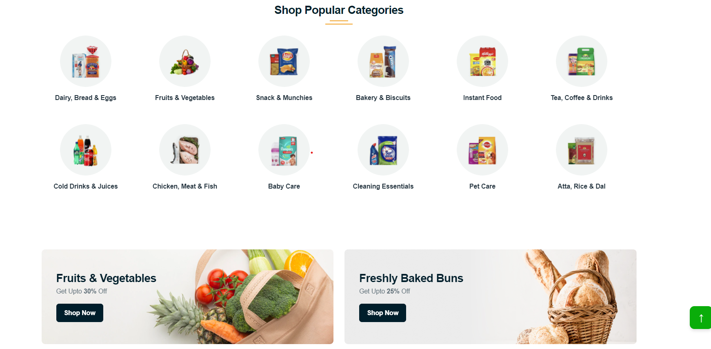
  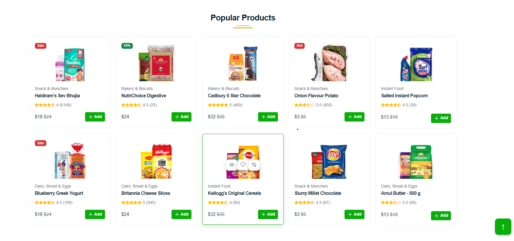
  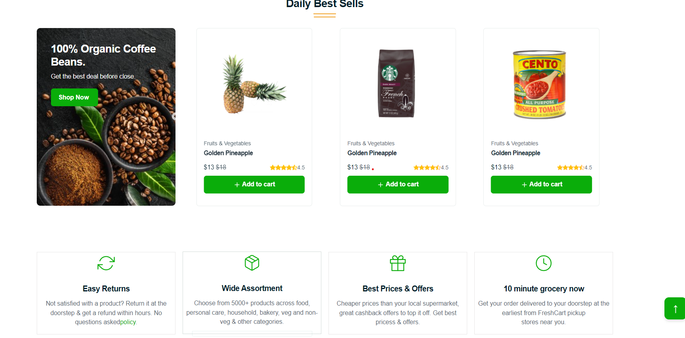
  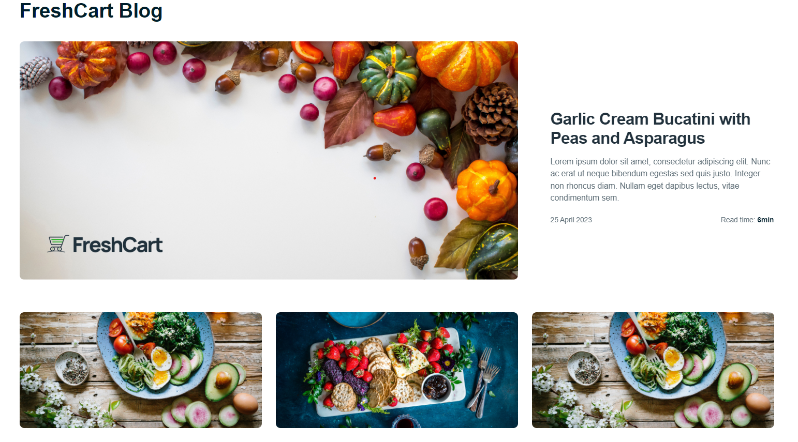
  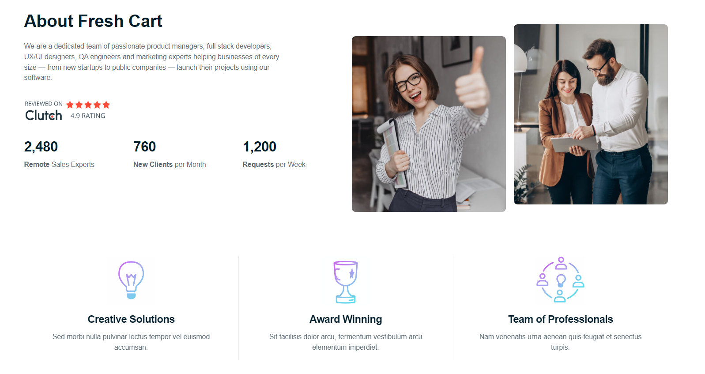
  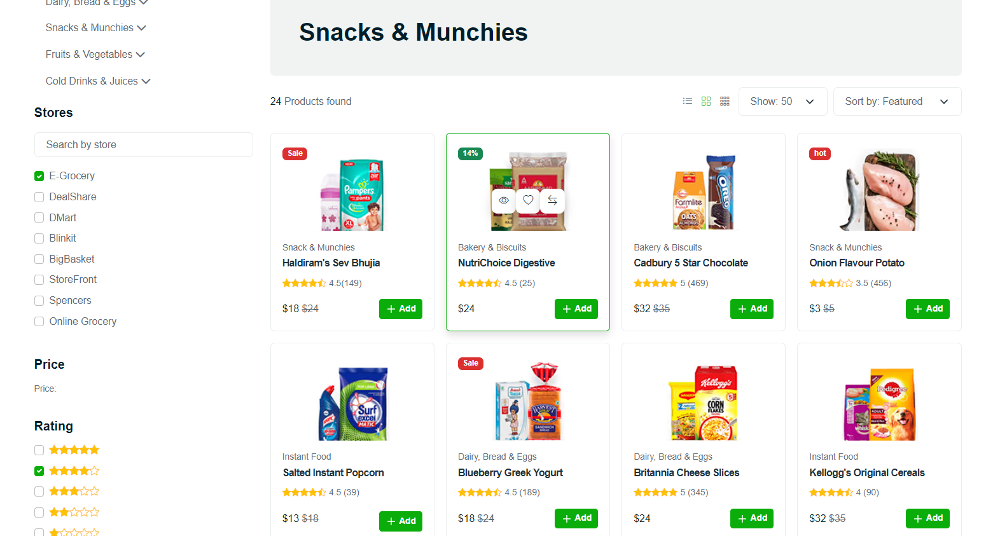
  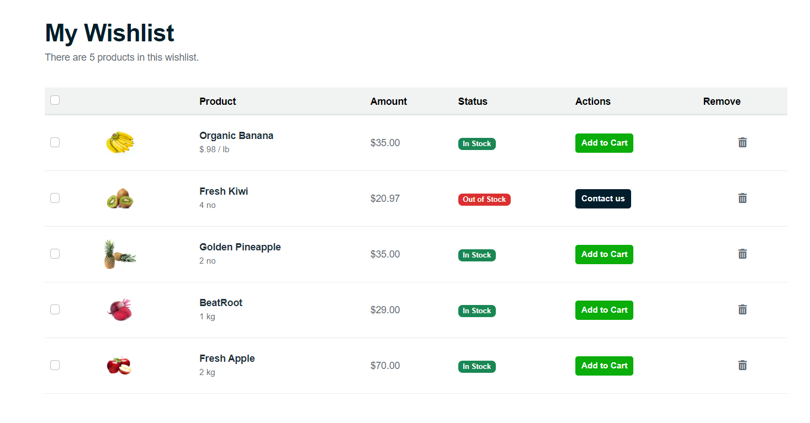
  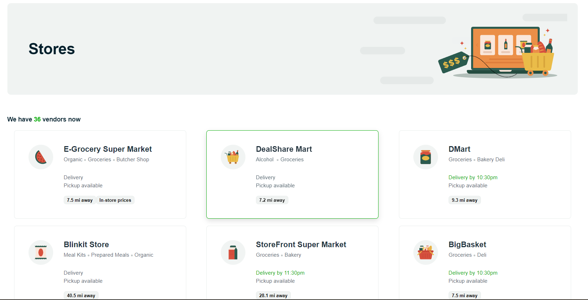
  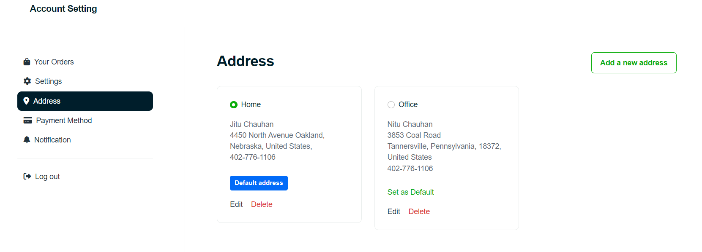
  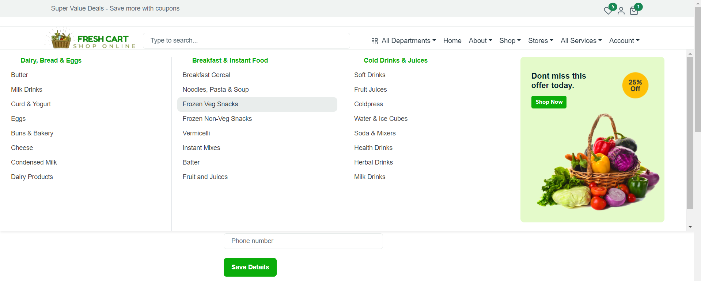
</p>

FreshCart is a **modern and beautiful React.js eCommerce template** designed for grocery stores, supermarkets, organic shops, and mega stores. It features a **clean design**, **fully responsive layout**, and **seamless user experience** on all devices.

---

## ✨ Key Features

### 🌐 General Features
- **Modern Tech Stack:** Built with React.js & Bootstrap 5
- **25+ Pre-built Pages** for all eCommerce needs
- **Multiple Homepage Layouts:** 3 unique designs
- **Flexible Headers:** 3 navigation styles
- **Fully Responsive:** Works on desktop, tablet & mobile
- **Cross-Browser Compatible**
- **Well-Documented** with clean code

### 🛒 eCommerce Shop Pages
- Shop Grid & List Views
- Detailed Product Pages
- Advanced Product Filters
- Shopping Cart & Wishlist
- Secure Checkout Process
- Quick View Popup
- Customer Reviews & Ratings
- Mega Menu for easy navigation

### 👤 Vendor & Account Pages
- Multi-vendor store design
- User Profile & Account Settings
- Order History & Details
- Payment & Address Management
- Notifications Center

---

## 🚀 Tech Stack

### 🖥️ Frontend
- **React.js** (v18+)
- **React Router** (v6)
- **Bootstrap** (v5)

### 🎨 UI Components & Libraries
- **React Slick & Swiper** (carousels)
- **Font Awesome** (icons)
- **SweetAlert2** (popups)
- **React Awesome Reveal** (animations)

### 🛠️ Development Tools
- **Create React App**
- **Jest & React Testing Library**

---

## 📦 Getting Started
Follow these instructions to get a copy of the project up and running on your local machine.

### 📋 Prerequisites
Make sure you have the following software installed:
* **Node.js** (v14 or later)
* **npm** (or **Yarn**)

### ⚙️ Installation
1.  **Clone the repository:**
    ```bash
    git clone [https://github.com/your-username/react-grocery.git](https://github.com/your-username/react-grocery.git)
    ```
2.  **Navigate to the project directory:**
    ```bash
    cd react-grocery
    ```
3.  **Install dependencies:**
    ```bash
    npm install
    ```
    or if you use Yarn:
    ```bash
    yarn install
    ```

### ▶️ Running the Application
1.  **Start the development server:**
    ```bash
    npm start
    ```
2.  Open [http://localhost:3000](http://localhost:3000) to view it in your browser.

### 🏭 Building for Production
To create a production-ready build:
```bash
npm run build
